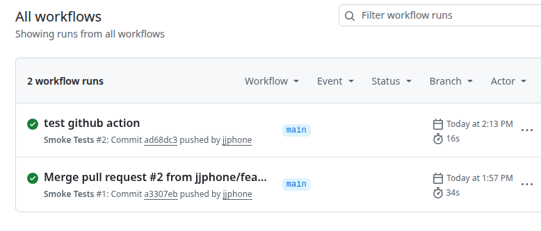

# cs-bookapi

This repository contains an automated test suite for the [Simple Books API](http://simple-books-api.glitch.me/books) `GET /books` endpoint, built to satisfy a technical assessment covering API automation, version control, and CI/CD.

## 1) API Automation

The suite is written in Java using REST Assured and Cucumber, following a BDD approach. It sends a `GET` request to `http://simple-books-api.glitch.me/books` and validates the response.

The feature file ([bookapi/src/test/resources/features/BooksList.feature](bookapi/src/test/resources/features/BooksList.feature)) defines two scenarios:


- Scenario 1: 
Test the response from the GET request. Checks the header attributes for the following fields: HTTP status code, response time, header date, header content-type, header content-length, as well as checking the response body is not empty and items have basic properties such as id and name. 
  1. Smoke Test : Check the response has status code of 200
  2. Regression: Check the all response and header attributes above, match to the given condition in <expect_header_attribs> for regression test. 


- Scenario 2:
Test the response content JSON data from the GET request. This is achieved by extracting the response JSON data, and filtering the array on items that contain the <expected_item_properties>, and matching the filtered array size to <expected_contains_number>. Similarly, there is another test on the same response for filtering items not containing <expected_filter_out_item_properties>
  1. Smoke Test: Check response JSON has book item id=1
  2. Regression: Check response JSON items contain all properties using `{notEmpty}` placeholder for non-blank field checks
  3. Regression: Check all property values of item 6 from the response JSON
  4. Regression: Check there are more than 4 items that are available (5)  


For both scenarios, validations are declared directly in the feature file's example tables rather than hard-coded in Java, so checks can be added or updated there without touching the step definitions. See [bookapi/install.md](bookapi/install.md) for prerequisites, installation, and how to run the tests (including running by `@smoke`/`@regression` tag).

## 2) Version Control

The project is version-controlled with Git and hosted on GitHub as the source of record: [https://github.com/jjphone/cs-bookapi](https://github.com/jjphone/cs-bookapi). Commit history reflects the incremental development of the framework, from initial setup through each added scenario and helper. All test framework code in this repository was written from scratch for this assessment; no existing framework was checked in.

## 3) CI/CD (Optional)

A GitHub Actions workflow ([.github/workflows/smoke-tests.yml](.github/workflows/smoke-tests.yml)) runs the `@smoke` test suite automatically whenever the `main` branch is updated or a pull request is merged into it, providing a fast regression signal on every change.



## Project layout

```
bookapi/                              Maven project
  src/test/resources/features/        Gherkin feature files (test cases)
  src/test/java/cs/step_definitions/  Cucumber step definitions
  src/test/java/cs/utils/             Helpers (param parsing, response attribute comparisons)
  src/test/java/cs/runner/            Cucumber JUnit Platform Suite runner
.github/workflows/                    CI pipeline (smoke tests on main)
```

